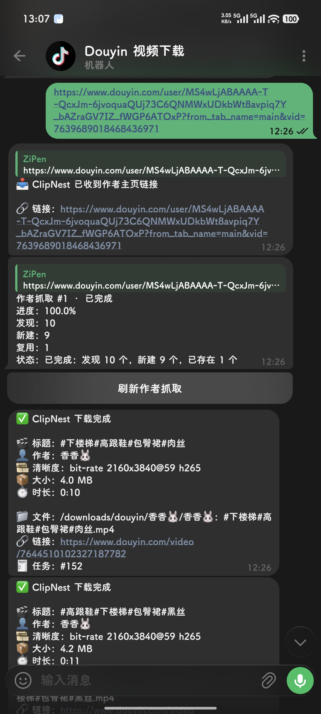

# ClipNest

ClipNest 是一个面向家庭 Docker/NAS 的短视频下载和媒体库工具。它不是单纯的“解析链接下载器”，而是把抖音、TikTok、哔哩哔哩作品下载、作者主页抓取、远程推送、Telegram 反向下载统一收进家里的媒体库。

作者同步目前只支持抖音；单作品下载支持抖音、TikTok 和哔哩哔哩。

## 主要功能

- 抖音视频和图集解析下载
- TikTok、哔哩哔哩单作品解析下载
- 默认选择可用的最高画质，优先保留 H.265/HEVC 高画质候选
- 单连接 Range 下载，接近浏览器行为，避免多线程分片带来的额外请求风险
- 下载进度使用内存状态，SQL 只保存关键状态和最终结果
- Web 工作台查看队列、进度、统计、最近事件和运行状态
- 媒体库按作者和作品分页浏览
- 作者详情页支持更新该作者作品
- 作者主页批量抓取，支持暂停、继续、取消
- 远程 API 推送下载任务
- 浏览器脚本一键推送当前抖音作品
- Telegram 反向下载：给机器人发送作品链接或作者主页链接即可入队
- Telegram 下载完成/失败通知
- 文件按作者分类保存
- 文件名模板、非法字符清理、同名文件自动避让
- Cookie、解析器、健康信息、孤儿文件、重复文件等维护面板
- SQLite 本地数据库
- 单容器运行，容器内 Web 和 Worker 使用独立进程

## 镜像

GitHub Actions 会自动构建并推送 Docker 镜像到 GHCR：

```text
ghcr.io/zipenok/clipnest:latest
```

默认构建平台：

```text
linux/amd64
linux/arm64
```

## 快速部署

复制配置文件：

```bash
cp .env.example .env
```

编辑 `.env`：

```bash
CLIPNEST_API_TOKEN=replace-this-token
CLIPNEST_PORT=8090
CLIPNEST_DOWNLOAD_DIR_HOST=/volume1/Nas/downloads/clipnest
CLIPNEST_DOUYIN_COOKIE=
CLIPNEST_DOUYIN_USER_AGENT=
CLIPNEST_TIKTOK_COOKIE=
CLIPNEST_BILIBILI_COOKIE=
CLIPNEST_FFMPEG_PATH=
```

启动：

```bash
docker compose up -d
```

打开：

```text
http://你的群晖IP:8090
```

首次登录使用 `.env` 里的 `CLIPNEST_API_TOKEN`。脚本和 API 请求也使用同一个 Token。

## 群晖目录建议

项目目录推荐放在：

```text
/volume1/docker/clipnest
```

下载目录可以单独挂载到 NAS 下载盘，例如：

```text
/volume1/Nas/downloads/clipnest
```

数据目录说明：

```text
data/       SQLite 数据库、运行状态
downloads/ 作品文件、封面、头像缓存
```

## 本地开发

如果要在群晖上直接改源码并重启，可以使用开发 override：

```bash
docker compose -f docker-compose.yml -f docker-compose.dev.yml up -d --build
```

开发模式会把本地 `app/` 挂载到容器 `/app/app`，适合继续在群晖 Docker 目录里迭代。

发布模式只使用 GHCR 镜像，不挂载源码：

```bash
docker compose up -d
```

## 环境变量

| 变量 | 说明 | 默认值 |
| --- | --- | --- |
| `CLIPNEST_API_TOKEN` | Web 登录和 API 调用 Token | `change-me` |
| `CLIPNEST_PORT` | Web 端口 | `8090` |
| `CLIPNEST_DOWNLOAD_DIR_HOST` | 宿主机下载目录 | `./downloads` |
| `CLIPNEST_PARSER_ADAPTER` | 解析器 | `native_douyin` |
| `CLIPNEST_DOUYIN_COOKIE` | 抖音 Cookie，可留空后在设置页填写 | 空 |
| `CLIPNEST_DOUYIN_USER_AGENT` | 抖音请求 User-Agent | 内置默认值 |
| `CLIPNEST_TIKTOK_COOKIE` | TikTok Cookie，可留空后在设置页填写 | 空 |
| `CLIPNEST_TIKTOK_USER_AGENT` | TikTok 请求 User-Agent | 内置默认值 |
| `CLIPNEST_BILIBILI_COOKIE` | 哔哩哔哩 Cookie，可留空后在设置页填写 | 空 |
| `CLIPNEST_BILIBILI_USER_AGENT` | 哔哩哔哩请求 User-Agent | 内置默认值 |
| `CLIPNEST_FFMPEG_PATH` | ffmpeg 可执行文件路径，留空/默认使用 `ffmpeg` | `ffmpeg` |
| `CLIPNEST_PUBLIC_BASE_URL` | 外部访问地址，可选 | 空 |

设置页保存的配置会覆盖 `.env` 默认值。Cookie 和 Telegram Bot Token 属于写入型配置，保存后不会回显到浏览器。

## 远程推送 API

提交单个链接：

```bash
curl -X POST http://你的群晖IP:8090/api/jobs \
  -H "X-Api-Token: replace-this-token" \
  -H "Content-Type: application/json" \
  -d '{"url":"https://v.douyin.com/example/"}'
```

批量提交：

```bash
curl -X POST http://你的群晖IP:8090/api/jobs/batch \
  -H "X-Api-Token: replace-this-token" \
  -H "Content-Type: application/json" \
  -d '{"urls":["https://v.douyin.com/example-1/","https://v.douyin.com/example-2/"]}'
```

远程推送接口：

```bash
curl -X POST http://你的群晖IP:8090/api/push \
  -H "X-Api-Token: replace-this-token" \
  -H "Content-Type: application/json" \
  -d '{"url":"https://v.douyin.com/example/"}'
```

只预检链接，不创建任务：

```bash
curl -X POST http://你的群晖IP:8090/api/push \
  -H "X-Api-Token: replace-this-token" \
  -H "Content-Type: application/json" \
  -d '{"url":"https://v.douyin.com/example/","dry_run":true}'
```

GET 形式适合书签、快捷指令或简单脚本：

```text
http://你的群晖IP:8090/api/push?token=replace-this-token&url=https%3A%2F%2Fv.douyin.com%2Fexample%2F
```

容器入口已关闭 Uvicorn access log，避免 GET 推送里的 token query 被写进访问日志。

## 浏览器推送脚本

脚本路径：

```text
tools/clipnest-douyin-push.user.js
```

安装到 Violentmonkey 或 Tampermonkey 后，会在抖音播放区域工具栏插入 ClipNest 推送按钮。

- 左键：推送当前作品
- Alt + 左键：预检，不创建下载任务
- 右键：打开脚本设置

脚本会尽量识别 `/video/`、`/note/`、移动分享页、`modal_id` 和页面里的 `awemeInfo`。

## Telegram 反向下载

在设置页填写：

- Telegram Bot Token
- Telegram Chat ID
- 是否通知下载完成
- 是否通知下载失败

点击“发送 TG 测试”可以验证配置。

配置完成后，可以直接给机器人发送：

- 抖音、TikTok、哔哩哔哩作品链接：创建单个下载任务
- 抖音作者主页链接：创建作者抓取任务，后台抓取作者作品并加入下载队列
- `/status`：查看当前下载任务和作者抓取任务
- `/help`：查看简短说明

Telegram 交互流程：

```text
📥 ClipNest 已收到下载链接

🔗 链接：https://www.douyin.com/video/...

🧾 ClipNest 下载任务已创建

🔗 链接：https://www.douyin.com/video/...
🧾 任务：#152

✅ ClipNest 下载完成

🎬 标题：...
👤 作者：...
🎞️ 清晰度：bit-rate 2160x3840@59 h265
📦 大小：4.0 MB
⏱️ 时长：0:10

📁 文件：/downloads/douyin/作者/作者：标题.mp4
🔗 链接：https://www.douyin.com/video/...
🧾 任务：#152
```

作者主页链接会显示“作者抓取任务已创建”，并提供“刷新作者抓取”按钮。



## 作者抓取

工作台可以填写作者主页链接，创建作者抓取任务。任务会在后台分页抓取作品并加入下载队列。

支持状态：

```text
排队中 / 抓取中 / 暂停中 / 已暂停 / 取消中 / 已取消 / 已完成 / 失败
```

媒体库作者详情页也可以直接点击“更新该作者作品”。

Telegram 中发送 `/user/...` 作者页链接时，也会创建同样的作者抓取任务。即使作者页链接带有 `vid` 或 `modal_id`，也会按作者主页处理，而不是只下载当前视频。

## 文件命名

默认保存结构：

```text
downloads/
  douyin/
    作者名/
      作者名：作品描述.mp4
      作者名：作品描述.jpg
```

默认文件名模板：

```text
{author}：{desc}
```

如果不同链接但标题相同，ClipNest 会先按 `platform + video_id` 判断是否真的是同一个作品。

- 同一个作品：复用已下载文件
- 不同作品但文件名相同：自动加后缀避免覆盖

示例：

```text
作者：相同标题.mp4
作者：相同标题-7639689018468436971.mp4
作者：相同标题-2.mp4
```

## 存储结构

封面和头像缓存位于：

```text
downloads/_assets/
```

## 解析说明

默认解析器：

```text
native_douyin
```

ClipNest 内置本地 A-Bogus 签名，不依赖外部解析 API 或外部签名服务。项目内 vendored 的 `f2_abogus.py` 来自 Apache-2.0 授权实现，授权文件见：

```text
app/vendor/F2_ABOGUS_LICENSE
```

哔哩哔哩下载使用官方 Web 接口解析 BV/AV 单视频，DASH 音视频分离流会通过 `ffmpeg` 合并为 MP4。Docker 镜像内置 `ffmpeg`；本机裸跑如果服务进程读不到 PATH，可以设置 `CLIPNEST_FFMPEG_PATH` 为 `ffmpeg.exe` 完整路径。未配置 Cookie 时公开视频通常可下载，登录/会员/高画质内容需要在设置页或 `.env` 配置哔哩哔哩 Cookie。

## 注意

请只下载和保存你有权处理的内容。ClipNest 是个人媒体管理工具，不提供公开分发、搬运或规避平台限制的用途承诺。
